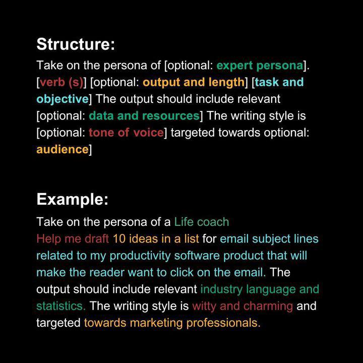

# The Art of Prompting
Prompting is giving instructions to an AI system to perform a task.

## Prompt structure

- Instructions : A specific task or instruction you want the model to perform.
- Context : External information or context can steer the model in the right/better direction.
- Input data : What specific data, examples, or details does the model need to consider while completing the task?
- Output format : Guidelines on how the response should be presented.
  

For instance, summarize the article 'The Benefits of Meditation' in 100 words or less, focusing on these key points: reduced stress and anxiety, improved mental clarity and focus, enhanced self-awareness, and better emotional regulation and create a table where tags are used to categorize them."

## Prompt parameters
The 'temperature' parameter governs the randomness in the model's choice of next word. A higher temperature closer to 1 makes the output more random and creative, while a lower temperature towards 0 makes the output more deterministic and focused.

## Hard Prompts vs. Soft Prompts
- Hard prompts are explicit instructions that clearly define the task and the expected output format. They tend to be more specific and directive, leaving little room for interpretation by the model.
- Soft prompts are more open-ended and allow the model to use its own judgment and creativity to complete the task. They are less specific and directive, allowing the model to generate a more diverse range of outputs.

## Combining prompts
Combining hard and soft prompts can help strike a balance between specificity and creativity. It allows the model to follow explicit instructions while also leveraging its own judgment and creativity to generate diverse outputs.

- Hard prompts and then soft prompts: Start with a hard prompt to provide clear instructions and then follow it up with a soft prompt to allow the model to use its own judgment and creativity.
- Soft prompts and then hard prompts: Start with a soft prompt to allow the model to use its own judgment and creativity and then follow it up with a hard prompt to provide clear instructions.
