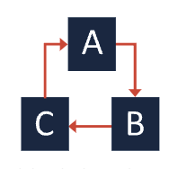

# Principle of package design

# Cohesion principles

_Cohesion_ : The degree to which the elements of a specific component belong together. Is about the way you can group code that contributes to a single task together.

Three primary cohesion principles help you compose components that are reusable and maintainable: the Common Closure Principle, the Common Reuse Principle, and the Reuse-Release Equivalence Principle.

### The common closure principle

States that the classes in a module should be closed together against the same kinds of changes. So, a change that affects a module affects all the classes in that module and does not affect other modules. ( Single Responsability and Open-Closed).

### The Common Reuse Principle

States that the classes in a module are resued together. If you reuse one of the classes ina module, you reuse them all.

### The reuse/release equivalance principle
Our units are going to be released together, they belong in one module.

The CRP and the REP might seem similar, but there is a key difference. The CRP emphasizes reusing units from the same module together, while the REP emphasizes reusing the entire module.

# Coupling principles

_Couping_ : is the measure of how closely connected two modules are.

The rule of thumb is: Strive for low coupling and high cohesion. This rule serves as a reminder that you should develop code that separates tasks and does not rely heavily on other code

### Acyclic dependencies principle
“Allow no cycles in a component-dependency graph.” According to the ADP, you should strive to implement a directed acyclic graph, which helps you avoid cyclic dependencies.

